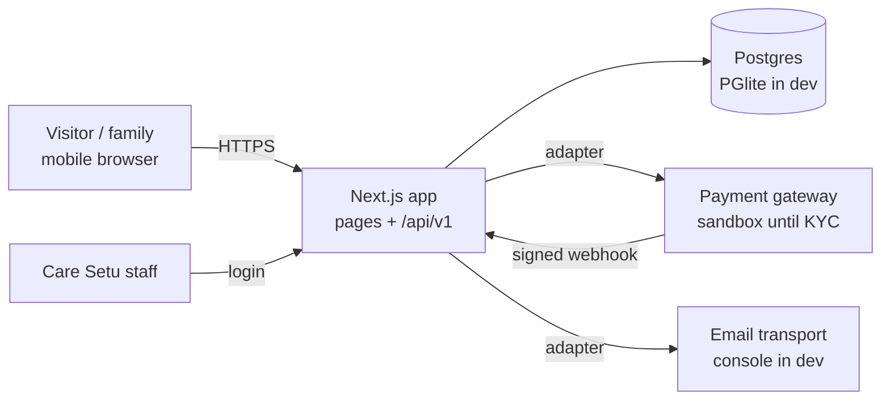
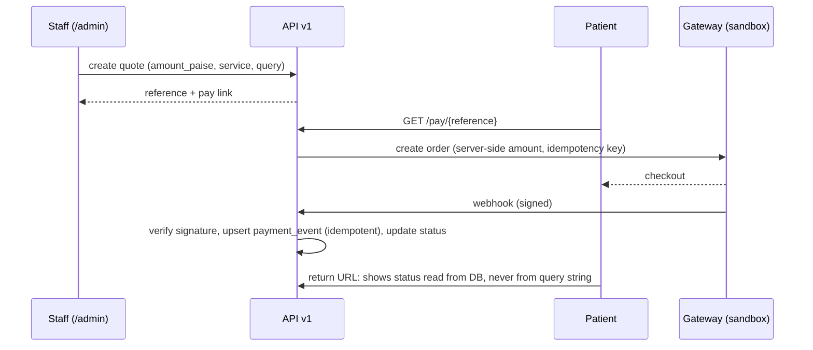

# Care Setu — Architecture (Phase 1)

**Version:** v0.1 · 2026-09-23 · Canonical home for system shape and module boundaries.
Detailed schema, API catalogue and security specs live in `TRD.md`.

## 1. System context

Hosting is undecided (D-002). The app is a single deployable Next.js service, portable to any Node host.

## 2. Layers and boundaries
```
app/                 routes only: pages, layouts, route handlers. Thin: parse → call domain → render.
  (site)/            public pages
  admin/             staff UI (noindex, auth required)
  api/v1/            versioned JSON API; the future apps call this too
server/
  domain/            business rules: queries, consents, quotes, payments, promotions. No framework imports.
  db/                Drizzle schema, migrations, repository functions
  adapters/
    payments/        PaymentProvider interface + sandbox implementation(s)
    email/           EmailTransport interface + console / provider implementations
  auth/              staff auth + session
  config/            typed env loading (zod), per-environment settings
  rate-limit.ts      public-form rate limit (in memory, per instance, D-033)
content/             message files (i18n-ready copy, D-008), service catalogue data
lib/                 shared pure helpers (money in paise, formatting, ids)
tests/               unit + contract + claims tests
```
**Dependency rule:** `app → server/domain → server/db | server/adapters`. The domain never imports
from `app/`. Adapters implement interfaces the domain owns. This is what lets the host, database,
gateway and email provider change without touching business rules (D-002, D-003, D-006).

## 3. Key data flows
**Query:** form → `POST /api/v1/queries` (zod) → domain `createQuery` (stores query + consent in one
transaction) → email adapter alert (after commit; failure is logged, not fatal) → 201.

**Quote → payment:**


## 4. Environments (brief NFR)
| Env | Database | Payments | Email | Hosting |
|---|---|---|---|---|
| dev | PGlite (in-process) | sandbox | console transport | local |
| staging | owner-chosen Postgres | sandbox | real provider, test inbox | owner-chosen (Q1) |
| production | owner-chosen Postgres | live after LLP + KYC | real provider | owner-chosen (Q1) |
Config comes from environment variables validated by zod at boot. A missing or invalid variable
fails the start, never falls back silently.

## 5. Forward compatibility (D-001)
- `/api/v1` contracts are defined as zod schemas shared by server and clients.
- The schema already has `providers` and `quotes.provider_id`, so the provider app adds views, not tables.
- Staff auth is role-based from the start (`admin`, `coordinator`), so provider/patient roles extend it.
